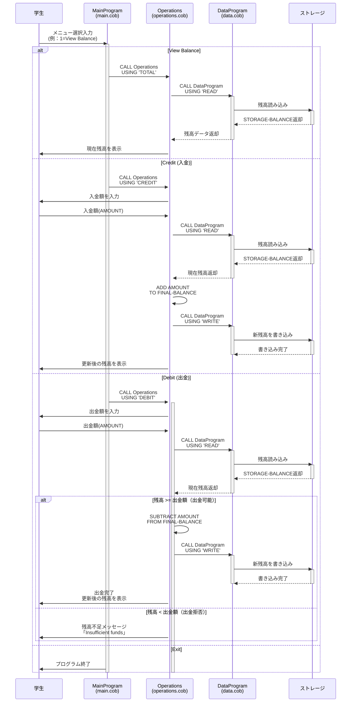

# COBOL Account Management System - ドキュメント

## 概要

このプロジェクトは、レガシーCOBOLで構築された**学生向け口座管理システム**です。学生が自分の銀行口座残高を管理し、入金（クレジット）・出金（デビット）操作を行うための統合システムです。

---

## ファイル構成と目的

### 1. **main.cob** - メインプログラム
**目的**：ユーザーインターフェース（UI）の提供とメニュー処理

**主要機能**：
- インタラクティブなメニューディスプレイの表示
- ユーザー入力の受け取り
- メニュー選択に応じた処理の振り分け
- プログラム終了処理

**メニューオプション**：
```
1. View Balance    → 現在の残高を表示
2. Credit Account  → 資金を入金する
3. Debit Account   → 資金を出金する
4. Exit            → プログラムを終了
```

### 2. **data.cob** - データ管理プログラム
**目的**：学生口座の残高データの永続的な保管と取得

**主要機能**：
- `READ`操作：ストレージから現在の残高を取得
- `WRITE`操作：新しい残高をストレージに書き込み
- データの信頼性と一貫性を確保

**初期値**：
- `STORAGE-BALANCE`: ¥1,000.00（初期残高）

### 3. **operations.cob** - 操作ロジックプログラム
**目的**：口座操作のビジネスロジック実行

**主要機能**：

#### TOTAL（残高照会）
- DataProgram呼び出しで現在残高を読み込み
- 学生に現在の残高を表示

#### CREDIT（入金/クレジット）
- ユーザーから入金額の入力を受け取り
- 現在の残高を読り込み
- 入金額を加算
- 新しい残高をストレージに保存
- 更新後の残高を表示

#### DEBIT（出金/デビット）
- ユーザーから出金額の入力を受け取り
- 現在の残高を読み込み
- **重要な業務ルール**：出金額が残高以下の場合のみ処理を実行
  - 出金可能：出金額を減算 → 新残高を保存 → 更新後の残高を表示
  - 出金不可：「残高不足」メッセージを表示
- 学生の過度な出金を防止

---

## 学生アカウントに関連する特定の業務ルール

### 1. **最小残高の維持**
- 初期残高：¥1,000.00
- 学生は常にこの基本残高を保持できます

### 2. **出金制限（重要）**
- **ルール**：出金額が現在の残高を超える場合、出金は実行されない
- **目的**：学生の過度な負債を防止し、口座の安全性を確保

```cobol
IF FINAL-BALANCE >= AMOUNT
    SUBTRACT AMOUNT FROM FINAL-BALANCE
    CALL 'DataProgram' USING 'WRITE', FINAL-BALANCE
    DISPLAY "Amount debited. New balance: " FINAL-BALANCE
ELSE
    DISPLAY "Insufficient funds for this debit."
END-IF
```

### 3. **入金機能**
- 学生は制限なく入金可能
- 奨学金、仕送り、バイト給料などの入金に対応

### 4. **金額精度**
- 金額データ型：`PIC 9(6)V99`
- 最大額：¥999,999.99
- 精度：小数点以下2桁（セント相当）
- 学生の少額取引から大型奨学金まで対応可能

### 5. **取引監査**
- 現在のシステムでは、各取引は即座にストレージに反映
- 取引履歴はシステム側で保持（ログ機能は将来実装予定）

---

## システムアーキテクチャ

```
┌─────────────────────┐
│   MainProgram       │ ← ユーザー入力を処理
│   (main.cob)        │
└──────────┬──────────┘
           │ CALL Operations
           │
┌──────────▼──────────┐
│   Operations        │ ← ビジネスロジック実行
│   (operations.cob)  │
└──────────┬──────────┘
           │ CALL DataProgram
           │
┌──────────▼──────────┐
│   DataProgram       │ ← データ永続化
│   (data.cob)        │
└─────────────────────┘
```

---

## 今後のモダナイゼーション

このシステムは以下の領域でモダナイゼーションの候補となります：

- [ ] Java / Kotlin などの言語への移行
- [ ] データベース（MySQL / PostgreSQL）への統合
- [ ] REST APIの実装
- [ ] Web UI/モバイルアプリの構築
- [ ] トランザクション管理の強化
- [ ] ログ・監査証跡の実装
- [ ] 複数口座対応
- [ ] 利息計算機能
- [ ] セキュリティ強化（認証・暗号化）

---

## 参考資料

- COBOL標準：COBOL-2002/2014
- 開発者向けコメント：各.cobファイルを参照

---

## データフロー - シーケンス図



---

*最終更新: 2026年3月30日*
